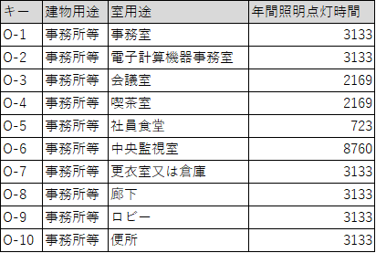

.. |m2| replace:: m\ :sup:`2` \
.. |m3| replace:: m\ :sup:`3` \

************************************************************************************************************************
昇降機
************************************************************************************************************************

========================================================================================================================
1 適用範囲
========================================================================================================================

計算の対象とする昇降機は次のとおりである。

#. トラクションタイプのロープ式乗用エレベータ

    - 人荷用エレベータ、非常用エレベータ、主動線にないエレベータも評価の対象とする。
    - 定員が定められているエレベータは原則として評価の対象とする。例えば、病院向けの寝台用エレベータは定員が定められるため、評価の対象とする。

次の昇降機は対象としない。

- 巻胴式、油圧式、リニアモーター式等の種々の駆動方式のエレベータ

- 小荷物専用昇降機や荷物用エレベータ、自動車用エレベータ、共同住宅で見られる地上階と屋内の駐輪場置場をつなぐエレベータ(自転車等の運搬を目的としたエレベータ)など、荷物の運搬を目的とした昇降機

- 工場等の生産エリアにおいて、物品の製造や運搬のために専用で利用する人荷用エレベータ(生 産に従事する作業員が生産物品を台車で上下階に運ぶために専用で利用するトラクションタイプ のロープ式エレベータ等)

- エスカレーター

- いす式階段昇降機、段差解消機

========================================================================================================================
2 引用規格
========================================================================================================================

なし

========================================================================================================================
3 用語の定義
========================================================================================================================

昇降機
    | 一定の昇降路、経路その他これに類する部分を介して、動力を用いて人または物を建築物のある階またはある部分から他の階または他の部分へ移動・運搬するための設備のこと。

昇降機系統
    | 一体として制御される昇降機群のことをいう。複数の昇降機で構成される場合もあれば、1台で系統が構成される場合もある。

積載質量
    | かごに乗り込む利用者及び搭載する荷物などの自重により生ずるかごの定格質量。

定格速度
    | かごが上昇、下降するときの毎分の定格速度。

速度制御方式による補正係数
    | 消費電力量を求めるための係数。消費電力は制御方式毎にエレベータの積載質量、速度、起動頻度に比例している。これらより各々の制御方式毎に導き出した換算係数。

========================================================================================================================
4 記号及び単位
========================================================================================================================

------------------------------------------------------------------------------------------------------------------------
4.1 記号
------------------------------------------------------------------------------------------------------------------------

この計算で用いる記号及び単位は表1による。

.. list-table:: 表1 記号及び単位
    :header-rows: 1
    :widths: 1,6,1

    * - 記号
      - 意味
      - 単位
    * - :math:`E_{EV}`
      - 昇降機の年間一次エネルギー消費量
      - MJ/year
    * - :math:`E_{EV}`
      - 昇降機系統の年間消費電力量
      - kWh/year
    * - :math:`f_{prime,e}`
      - 電気の量1キロワット時を熱量に換算する係数
      - MJ/kwh
    * - :math:`L_{EV}`
      - 昇降機系統の積載質量
      - kg
    * - :math:`V_{EV}`
      - 昇降機系統の定格速度
      - m/min
    * - :math:`C_{EV}`
      - 昇降機系統の速度制御方式に応じて定められる係数
      - －
    * - :math:`T_{EV}`
      - 昇降機系統の年間運転時間
      - h/year
    * - :math:`N_{EV,i}`
      - 昇降機系統に属する昇降機の数
      - －

------------------------------------------------------------------------------------------------------------------------
4.2 添え字
------------------------------------------------------------------------------------------------------------------------

この計算で用いる添え字は表2による。

.. list-table:: 表2 添え字
    :header-rows: 1
    :widths: 1,7

    * - 添え字
      - 意味
    * - :math:`i`
      - 昇降機系統

========================================================================================================================
5 昇降機の年間一次エネルギー消費量
========================================================================================================================

昇降機の年間一次エネルギー消費量 :math:`E_{EV}` MJ/year は次式により表される。

.. math::
   :nowrap:

   \begin{align*}
        E_{EV} = \sum_{i}{E_{EV,i}} \cdot f_{prime,e} \cdot 10^{-3} \tag{1}
   \end{align*}

:math:`E_{EV}`
    | 昇降機の年間一次エネルギー消費量, MJ/year
:math:`E_{EV,i}`
    | 昇降機系統 :math:`i` の年間消費電力量, kWh/year
:math:`f_{prime,e}`
    | 電気の量1キロワット時を熱量に換算する係数, MJ/kwh

========================================================================================================================
6 昇降機系統の年間消費電力量
========================================================================================================================

昇降機系統 :math:`i` の年間消費電力量 :math:`E_{EV,i}` は次式により表される。

.. math::
   :nowrap:

   \begin{align*}
        E_{EV,i} =  \frac{ L_{EV,i} \cdot V_{EV,i} \cdot C_{EV,i} \cdot T_{EV,i} \cdot N_{EV,i}}{860}  \tag{2}
   \end{align*}

:math:`E_{EV,i}`
    | 昇降機系統 :math:`i` の年間消費電力量, kWh/year
:math:`L_{EV,i}`
    | 昇降機系統 :math:`i` の積載質量, kg
:math:`V_{EV,i}`
    | 昇降機系統 :math:`i` の定格速度, m/min
:math:`C_{EV,i}`
    | 昇降機系統 :math:`i` の速度制御方式に応じて定められる係数, -
:math:`T_{EV,i}`
    | 昇降機系統 :math:`i` の年間運転時間, h/year
:math:`N_{EV,i}`
    | 昇降機系統 :math:`i` に属する昇降機の数, -

.. note::
    分母の860の由来は？

========================================================================================================================
7 速度制御方式に応じて定められる係数
========================================================================================================================

昇降機系統 :math:`i` の速度制御方式に応じて定められる係数 :math:`C_{EV,i}` は昇降機系統 :math:`i` の速度制御方式の種類に応じて次表で表される。
なお、速度制御方式の種類が指定されていない（入力シートの当該欄が空欄である）場合は、
昇降機系統 :math:`i` の速度制御方式の種類に「交流帰還制御方式」が選択されたものとする。

.. csv-table:: 表1 速度制御方式に応じて定められる係数
    :header-rows: 1

    速度制御方式の種類, 係数
    可変電圧可変周波数制御方式（電力回生ありかつギアレス巻上機）, 1/50
    可変電圧可変周波数制御方式（電力回生あり）, 1/45
    可変電圧可変周波数制御方式（電力回生なしかつギアレス巻上機）, 1/45
    可変電圧可変周波数制御方式（電力回生なし）, 1/40
    交流帰還制御方式, 1/20

========================================================================================================================
8 昇降機系統の年間運転時間
========================================================================================================================

昇降機系統 :math:`i` の年間運転時間 :math:`T_{EV,i}` は、照明設備の年間点灯時間と等しいとする。 
建物用途名称及び室用途名称に応じて データ「照明設備の年間点灯時間」（csv/table_elevator_1.csv）で定められることとする。

    図1 データ「照明設備の年間点灯時間」（例示：先頭10行のみ示す）