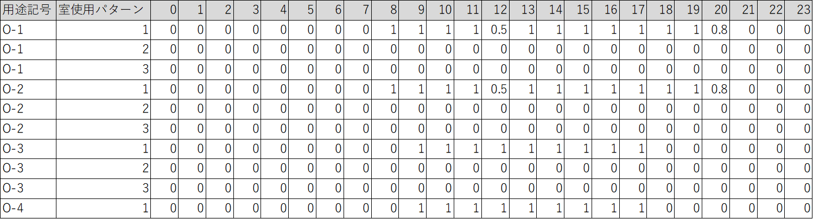
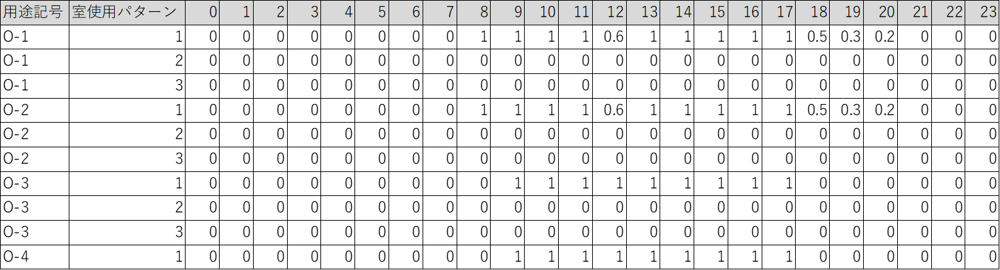
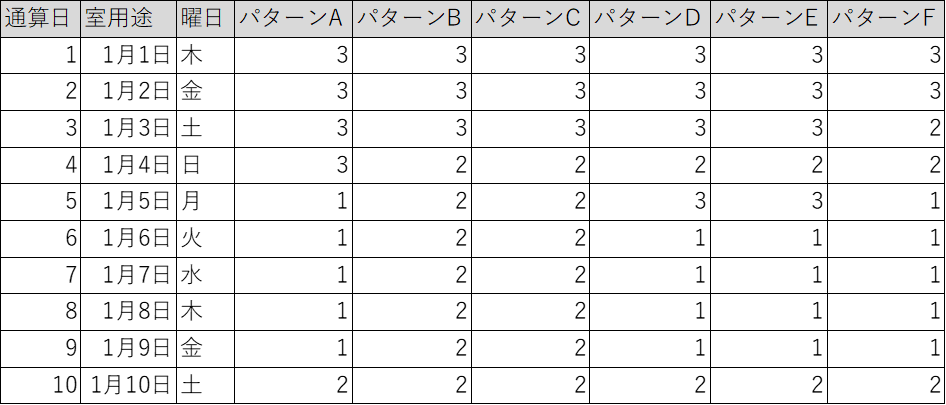

.. |m2| replace:: m\ :sup:`2` \

************************************************************************************************************************
その他
************************************************************************************************************************

========================================================================================================================
第1節 気象条件
========================================================================================================================

------------------------------------------------------------------------------------------------------------------------
1 適用範囲
------------------------------------------------------------------------------------------------------------------------

本節では、外気温度・湿度・日射量・太陽位置などの気象データの計算方法を定義する。

========================================================================================================================
第2節 室同時使用率・照明発熱密度比率・機器発熱密度比率
========================================================================================================================

本章では、表1・表2・表3・表4は、本章の最後に記す。

------------------------------------------------------------------------------------------------------------------------
1 定義
------------------------------------------------------------------------------------------------------------------------

本節では、室 :math:`r` の建物用途・室用途から
室 :math:`r` の日付 :math:`d` の時刻 :math:`t` における室同時使用率・照明発熱密度比率・機器発熱密度比率の求め方を示す。

これらの値は、以下の手順により求める。

ステップ1
    | 室 :math:`r` の建物用途・室用途から、1.6 に示す方法により室 :math:`r` のカレンダーパターンを求める。
    | 例） 用途記号「O-1」 建物用途「事務所等」 室用途「事務室」 の場合、カレンダーパターン「A」である。
ステップ2
    | 室 :math:`r` のカレンダーパターンから、1.5に示す方法により室 :math:`r` の日付 :math:`d` の室使用パターンを求める。
    | 例） カレンダーパターン「A」の場合、1月1日の室使用パターンは「3」、1月2日は「3」というように365日分定まる。
ステップ3
    | 室 :math:`r` の日付 :math:`d` の室使用パターンから、1.1～1.4に示す方法により室 :math:`r` の日付 :math:`d` の時刻 :math:`t` における室同時使用率・照明発熱密度比率・機器発熱密度比率を求める。
    | 例） 用途記号「O-1」 建物用途「事務所等」 室用途「事務室」 1月1日の室使用パターンは「3」であるから、0時の室同時使用率は0.0, 例えば8時の場合は1.0というように定まる。

^^^^^^^^^^^^^^^^^^^^^^^^^^^^^^^^^^^^^^^^^^^^^^^^^^^^^^^^^^^^^^^^^^^^^^^^^^^^^^^^^^^^^^^^^^^^^^^^^^^^^^^^^^^^^^^^^^^^^^^^
1.1 室同時使用率
^^^^^^^^^^^^^^^^^^^^^^^^^^^^^^^^^^^^^^^^^^^^^^^^^^^^^^^^^^^^^^^^^^^^^^^^^^^^^^^^^^^^^^^^^^^^^^^^^^^^^^^^^^^^^^^^^^^^^^^^

室 :math:`r` の日付 :math:`d` の時刻 :math:`t` における室同時使用率 :math:`r_{su,r,d,t}` は
室 :math:`r` の建物用途・室用途及び日付 :math:`d` に応じて定められる室使用パターンに応じて表1に示すとおり
日付 :math:`d` の0時から23時までの値が定まる。

^^^^^^^^^^^^^^^^^^^^^^^^^^^^^^^^^^^^^^^^^^^^^^^^^^^^^^^^^^^^^^^^^^^^^^^^^^^^^^^^^^^^^^^^^^^^^^^^^^^^^^^^^^^^^^^^^^^^^^^^
1.2 照明発熱密度比率
^^^^^^^^^^^^^^^^^^^^^^^^^^^^^^^^^^^^^^^^^^^^^^^^^^^^^^^^^^^^^^^^^^^^^^^^^^^^^^^^^^^^^^^^^^^^^^^^^^^^^^^^^^^^^^^^^^^^^^^^

室 :math:`r` の日付 :math:`d` の時刻 :math:`t` における照明発熱密度比率 :math:`r_{lhgd,r,d,t}` は
室 :math:`r` の建物用途・室用途及び日付 :math:`d` に応じて定められる室使用パターンに応じて表2に示すとおり
日付 :math:`d` の0時から23時までの値が定まる。

^^^^^^^^^^^^^^^^^^^^^^^^^^^^^^^^^^^^^^^^^^^^^^^^^^^^^^^^^^^^^^^^^^^^^^^^^^^^^^^^^^^^^^^^^^^^^^^^^^^^^^^^^^^^^^^^^^^^^^^^
1.3 人体発熱密度比率
^^^^^^^^^^^^^^^^^^^^^^^^^^^^^^^^^^^^^^^^^^^^^^^^^^^^^^^^^^^^^^^^^^^^^^^^^^^^^^^^^^^^^^^^^^^^^^^^^^^^^^^^^^^^^^^^^^^^^^^^

室 :math:`r` の日付 :math:`d` の時刻 :math:`t` における人体発熱密度比率 :math:`r_{hhgd,r,d,t}`は
室 :math:`r` の建物用途・室用途及び日付 :math:`d` に応じて定められる室使用パターンに応じて表3に示すとおり
日付 :math:`d` の0時から23時までの値が定まる。

^^^^^^^^^^^^^^^^^^^^^^^^^^^^^^^^^^^^^^^^^^^^^^^^^^^^^^^^^^^^^^^^^^^^^^^^^^^^^^^^^^^^^^^^^^^^^^^^^^^^^^^^^^^^^^^^^^^^^^^^
1.4 機器発熱密度比率
^^^^^^^^^^^^^^^^^^^^^^^^^^^^^^^^^^^^^^^^^^^^^^^^^^^^^^^^^^^^^^^^^^^^^^^^^^^^^^^^^^^^^^^^^^^^^^^^^^^^^^^^^^^^^^^^^^^^^^^^

室 :math:`r` の日付 :math:`d` の時刻 :math:`t` における機器発熱密度比率 :math:`r_{ahgd,r,d,t}`は
室 :math:`r` の建物用途・室用途及び日付 :math:`d` に応じて定められる室使用パターンに応じて表4に示すとおり
日付 :math:`d` の0時から23時までの値が定まる。

^^^^^^^^^^^^^^^^^^^^^^^^^^^^^^^^^^^^^^^^^^^^^^^^^^^^^^^^^^^^^^^^^^^^^^^^^^^^^^^^^^^^^^^^^^^^^^^^^^^^^^^^^^^^^^^^^^^^^^^^
1.5 室使用パターン
^^^^^^^^^^^^^^^^^^^^^^^^^^^^^^^^^^^^^^^^^^^^^^^^^^^^^^^^^^^^^^^^^^^^^^^^^^^^^^^^^^^^^^^^^^^^^^^^^^^^^^^^^^^^^^^^^^^^^^^^

室 :math:`r` の日付 :math:`d` における室使用パターンは、
室 :math:`r` の建物用途・室用途及に応じて定められるカレンダーパターンに応じて表5に示すとおり定まる。

^^^^^^^^^^^^^^^^^^^^^^^^^^^^^^^^^^^^^^^^^^^^^^^^^^^^^^^^^^^^^^^^^^^^^^^^^^^^^^^^^^^^^^^^^^^^^^^^^^^^^^^^^^^^^^^^^^^^^^^^
1.6 カレンダーパターン
^^^^^^^^^^^^^^^^^^^^^^^^^^^^^^^^^^^^^^^^^^^^^^^^^^^^^^^^^^^^^^^^^^^^^^^^^^^^^^^^^^^^^^^^^^^^^^^^^^^^^^^^^^^^^^^^^^^^^^^^

室 :math:`r` のカレンダーパターンは表6により定まる。

------------------------------------------------------------------------------------------------------------------------
2. 各種表
------------------------------------------------------------------------------------------------------------------------

    図1 データ「建物用途・室用途（用途記号）及び室使用パターンに応じた室同時使用率」（例示：先頭10行のみ示す）

    図2 データ「建物用途・室用途（用途記号）及び室使用パターンに応じた照明発熱密度比率」（例示：先頭10行のみ示す）

    図3 データ「建物用途・室用途（用途記号）及び室使用パターンに応じた人体発熱密度比率」（例示：先頭10行のみ示す）

    図4 データ「建物用途・室用途（用途記号）及び室使用パターンに応じた機器発熱密度比率」（例示：先頭10行のみ示す）

    図5 データ「カレンダーパターンごとの室使用パターン」（例示：先頭10行のみ示す）

    図6 データ「建物用途・室用途（用途記号）により定まるカレンダーパターン」（例示：先頭10行のみ示す）

各列の意味は以下のとおりとする。

.. list-table:: 表1 データ「建物用途・室用途（用途記号）及び室使用パターンに応じた室同時使用率」の項目
    :header-rows: 1

    * - 列名称
      - 内容
    * - 用途記号
      - 用途記号
    * - 室使用パターン
      - 室使用パターン
    * - 0, 1, 2, ... , 23
      - 各時刻の室同時使用率

.. list-table:: 表2 データ「建物用途・室用途（用途記号）及び室使用パターンに応じた照明発熱密度比率」の項目
    :header-rows: 1

    * - 列名称
      - 内容
    * - 用途記号
      - 用途記号
    * - 室使用パターン
      - 室使用パターン
    * - 0, 1, 2, ... , 23
      - 各時刻の照明発熱密度比率

.. list-table:: 表3 データ「建物用途・室用途（用途記号）及び室使用パターンに応じた人体発熱密度比率」の項目
    :header-rows: 1

    * - 列名称
      - 内容
    * - 用途記号
      - 用途記号
    * - 室使用パターン
      - 室使用パターン
    * - 0, 1, 2, ... , 23
      - 各時刻の人体発熱密度比率

.. list-table:: 表4 データ「建物用途・室用途（用途記号）及び室使用パターンに応じた機器発熱密度比率」の項目
    :header-rows: 1

    * - 列名称
      - 内容
    * - 用途記号
      - 用途記号
    * - 室使用パターン
      - 室使用パターン
    * - 0, 1, 2, ... , 23
      - 各時刻の機器発熱密度比率

.. list-table:: 表5 データ「カレンダーパターンごとの室使用パターン」の項目
    :header-rows: 1

    * - 列名称
      - 内容
    * - 通算日
      - 1/1から数えた通算した日
    * - 室用途
      - 室用途
    * - 曜日
      - 曜日
    * - パターンA～F
      - カレンダーパターンA～Fのそれぞれの室使用パターン

.. list-table:: 表6 データ「建物用途・室用途（用途記号）により定まるカレンダーパターン」の項目
    :header-rows: 1

    * - 列名称
      - 内容
    * - 用途記号
      - 用途記号
    * - 建物用途
      - 建物用途
    * - 室用途
      - 室用途
    * - カレンダーパターン
      - カレンダーパターン（A～Fの値をとる）
