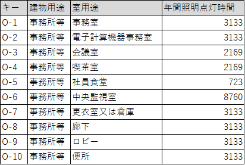

************************************************************************************************************************
基準一次エネルギー消費量
************************************************************************************************************************

========================================================================================================================
1 適用範囲
========================================================================================================================

========================================================================================================================
2 引用規格
========================================================================================================================

なし

========================================================================================================================
3 用語の定義
========================================================================================================================

========================================================================================================================
4 記号及び単位
========================================================================================================================

------------------------------------------------------------------------------------------------------------------------
4.1 記号
------------------------------------------------------------------------------------------------------------------------

この計算で用いる記号及び単位は表1による。

.. list-table:: 表1 記号及び単位
    :header-rows: 1
    :widths: 1,6,1

    * - 記号
      - 意味
      - 単位
    * - :math:`E_{ST}`
      - 基準一次エネルギー消費量
      - MJ/year
    * - :math:`E_{SAC}`
      - 空気調和設備の基準一次エネルギー消費量
      - MJ/year
    * - :math:`E_{SV}`
      - 機械換気設備の基準一次エネルギー消費量
      - MJ/year
    * - :math:`E_{SL}`
      - 照明設備の基準一次エネルギー消費量
      - MJ/year
    * - :math:`E_{SHW}`
      - 給湯設備の基準一次エネルギー消費量
      - MJ/year
    * - :math:`E_{SEV}`
      - 昇降機の基準一次エネルギー消費量
      - MJ/year
    * - :math:`n_{AC}`
      - 空調計算対象室の数
      - -
    * - :math:`a_{SAC}`
      - 空調計算対象室の空気調和設備の床面積あたりの基準一次エネルギー消費量
      - MJ/m2 year
    * - :math:`A_{AC}`
      - 空調計算対象室の床面積
      - m2
    * - :math:`n_{V}`
      - 換気計算対象室の数
      - -
    * - :math:`a_{SV}`
      - 換気計算対象室の機械換気設備の床面積あたりの基準一次エネルギー消費量
      - MJ/m2 year
    * - :math:`A_{V}`
      - 換気計算対象室の床面積
      - m2
    * - :math:`n_{L}`
      - 照明計算対象室の数
      - -
    * - :math:`a_{SL}`
      - 照明計算対象室の照明設備の床面積あたりの基準一次エネルギー消費量
      - MJ/m2 year
    * - :math:`A_{L}`
      - 照明計算対象室の床面積
      - m2      
    * - :math:`n_{HW}`
      - 給湯計算対象室の数
      - -
    * - :math:`a_{SHW}`
      - 給湯計算対象室の給湯設備の床面積あたりの基準一次エネルギー消費量
      - MJ/m2 year
    * - :math:`A_{HW}`
      - 給湯計算対象室の床面積
      - m2           
    * - :math:`n_{EV}`
      - 昇降機系統の数
      - －
    * - :math:`L_{EV}`
      - 昇降機系統の積載質量
      - kg
    * - :math:`V_{EV}`
      - 昇降機系統の定格速度
      - m/min
    * - :math:`C_{SEV}`
      - 昇降機系統の基準設定速度制御係数係数
      - －
    * - :math:`T_{EV}`
      - 昇降機系統の年間運転時間
      - h/year
    * - :math:`M_{EV}`
      - 昇降機系統の輸送能力係数
      - －      
    * - :math:`N_{EV}`
      - 昇降機系統に属する昇降機の数
      - －
    * - :math:`f_{prim,e}`
      - 電気の量1キロワット時を熱量に換算する係数
      - kJ/kWh  

------------------------------------------------------------------------------------------------------------------------
4.2 添え字
------------------------------------------------------------------------------------------------------------------------

この計算で用いる添え字は表2による。

.. list-table:: 表2 添え字
    :header-rows: 1
    :widths: 1,7

    * - 添え字
      - 意味
    * - :math:`r`
      - 計算対象室
    * - :math:`i`
      - 昇降機系統      

========================================================================================================================
5 基準一次エネルギー消費量
========================================================================================================================

基準一次エネルギー消費量  :math:`E_{ST}` GJ/year は次式により計算した値の小数第二位を切り上げた値とする。

.. math::
   :nowrap:

   \begin{align*}
        E_{ST} = ( E_{SAC} + E_{SV} + E_{SL} + E_{SHW} + E_{SEV} ) \cdot 10^{−3} \tag{1}
   \end{align*}

:math:`E_{ST}`
    | 基準一次エネルギー消費量, MJ/year
:math:`E_{SAC}`
    | 空気調和設備の基準一次エネルギー消費量, MJ/year
:math:`E_{SV}`
    | 機械換気設備の基準一次エネルギー消費量, MJ/year
:math:`E_{SL}`
    | 照明設備の基準一次エネルギー消費量, MJ/year
:math:`E_{SHW}`
    | 給湯設備の基準一次エネルギー消費量, MJ/year
:math:`E_{SEV}`
    | 昇降機の基準一次エネルギー消費量, MJ/year

========================================================================================================================
6 空気調和設備の基準一次エネルギー消費量
========================================================================================================================

空気調和設備の基準一次エネルギー消費量  :math:`E_{SAC}` MJ/year は次式により計算した値とする。

.. math::
   :nowrap:

   \begin{align*}
        E_{SAC} = \sum_{r=1}^{n_{AC}}{ a_{SAC,r} \cdot A_{AC,r}} \tag{2}
   \end{align*}

:math:`E_{SAC}`
    | 空気調和設備の基準一次エネルギー消費量, MJ/year
:math:`n_{AC}`
    | 空調計算対象室の数, -
:math:`a_{SAC,r}`
    | 空調計算対象室 :math:`r` の空気調和設備の床面積あたりの基準一次エネルギー消費量, MJ/m2 year
:math:`A_{AC,r}`
    | 空調計算対象室 :math:`r` の床面積, m2

空調計算対象室 :math:`r` の空気調和設備の床面積あたりの基準一次エネルギー消費量 :math:`a_{SAC,r}`は付録Aに定める。

========================================================================================================================
7 機械換気設備の基準一次エネルギー消費量
========================================================================================================================

機械換気設備の基準一次エネルギー消費量  :math:`E_{SV}` MJ/year は次式により計算した値とする。

.. math::
   :nowrap:

   \begin{align*}
        E_{SV} = \sum_{r=1}^{n_{V}}{ a_{SV,r} \cdot A_{r}} \tag{3}
   \end{align*}

:math:`E_{SV}`
    | 機械換気設備の基準一次エネルギー消費量, MJ/year
:math:`n_{V}`
    | 換気計算対象室の数, -
:math:`a_{SV,r}`
    | 換気計算対象室 :math:`r` の機械換気設備の床面積あたりの基準一次エネルギー消費量, MJ/m2 year
:math:`A_{V,r}`
    | 換気計算対象室 :math:`r` の床面積, m2

換気計算対象室 :math:`r` の機械換気設備の床面積あたりの基準一次エネルギー消費量 :math:`a_{SV,r}`は付録Bに定める。

========================================================================================================================
8 照明設備の基準一次エネルギー消費量
========================================================================================================================

照明設備の基準一次エネルギー消費量  :math:`E_{SL}` MJ/year は次式により計算した値とする。

.. math::
   :nowrap:

   \begin{align*}
        E_{SL} = \sum_{r=1}^{n_{L}}{ a_{SL,r} \cdot A_{r}} \tag{4}
   \end{align*}

:math:`E_{SL}`
    | 照明設備の基準一次エネルギー消費量, MJ/year
:math:`n_{L}`
    | 照明計算対象室の数, -
:math:`a_{SL,r}`
    | 照明計算対象室 :math:`r` の照明設備の床面積あたりの基準一次エネルギー消費量, MJ/m2 year
:math:`A_{L,r}`
    | 照明計算対象室 :math:`r` の床面積, m2

照明計算対象室 :math:`r` の照明設備の床面積あたりの基準一次エネルギー消費量 :math:`a_{SL,r}`は付録Cに定める。

========================================================================================================================
9 給湯設備の基準一次エネルギー消費量
========================================================================================================================

給湯設備の基準一次エネルギー消費量  :math:`E_{SHW}` MJ/year は次式により計算した値とする。

.. math::
   :nowrap:

   \begin{align*}
        E_{SHW} = \sum_{r=1}^{n_{HW}}{ a_{SHW,r} \cdot A_{r}} \tag{5}
   \end{align*}

:math:`E_{SHW}`
    | 給湯設備の基準一次エネルギー消費量, MJ/year
:math:`n_{HW}`
    | 給湯計算対象室の数, -
:math:`a_{SHW,r}`
    | 給湯計算対象室 :math:`r` の給湯設備の床面積あたりの基準一次エネルギー消費量, MJ/m2 year
:math:`A_{HW,r}`
    | 給湯計算対象室 :math:`r` の床面積, m2

給湯計算対象室 :math:`r` の給湯設備の床面積あたりの基準一次エネルギー消費量 :math:`a_{SHW,r}`は付録Dに定める。

========================================================================================================================
10 昇降機の基準一次エネルギー消費量
========================================================================================================================

昇降機の基準一次エネルギー消費量  :math:`E_{SHW}` MJ/year は次式により計算した値とする。

.. math::
   :nowrap:

   \begin{align*}
        E_{SEV} =  \sum_{i=1}^{n_{EV}}{\frac{ L_{EV,i} \cdot V_{EV,i} \cdot C_{SEV,i} \cdot T_{EV,i} \cdot M_{EV,i} \cdot N_{EV,i}}{860}} \cdot f_{prim,e} \cdot 10^{−3}  \tag{6}
   \end{align*}

:math:`E_{SEV}`
    | 昇降機の基準一次エネルギー消費量, MJ/year
:math:`n_{EV}`
    | 昇降機系統の数, -
:math:`L_{EV,i}`
    | 昇降機系統 :math:`i` の積載質量, kg
:math:`V_{EV,i}`
    | 昇降機系統 :math:`i` の定格速度, m/min
:math:`C_{SEV,i}`
    | 昇降機系統 :math:`i` の基準設定速度制御係数, -
:math:`T_{EV,i}`
    | 昇降機系統 :math:`i` の年間運転時間, h/year
:math:`M_{EV,i}`
    | 昇降機系統 :math:`i` の輸送能力係数, -
:math:`N_{EV,i}`
    | 昇降機系統 :math:`i` に属する昇降機の数, -
:math:`f_{prim,e}`
    | 電気の量1キロワット時を熱量に換算する係数, kJ/kWh

.. note::
    分母の860の由来は？

ここで、昇降機系統 :math:`i` の基準設定速度制御係数 :math:`C_{SEV,i}` は :math:`1/40` とする。 [#f1]_

昇降機系統 :math:`i` の年間運転時間 :math:`T_{EV,i}` は、照明設備の年間点灯時間と等しいとする。 
建物用途名称及び室用途名称に応じて データ「照明設備の年間点灯時間」（csv/table_elevator_1.csv）で定められることとする。

    図1 データ「照明設備の年間点灯時間」（例示：先頭10行のみ示す）

.. [#f1] この値は、速度制御方式が「可変電圧可変周波数制御方式（電力回生なし）」のときの速度制御係数である。

========================================================================================================================
付録 A 空気調和設備の床面積あたりの基準一次エネルギー消費量
========================================================================================================================

空調計算対象室 :math:`r` の空気調和設備の床面積あたりの基準一次エネルギー消費量 :math:`a_{SAC,r}`は、
省エネ基準地域区分および空調計算対象室 :math:`r` の建物用途名称及び室用途名称に応じて
データ「空気調和設備の床面積あたりの基準一次エネルギー消費量」（csv/table_standard_Appendix_A.csv）で定められることとする。

    図2 データ「空気調和設備の床面積あたりの基準一次エネルギー消費量」（例示：先頭10行のみ示す）